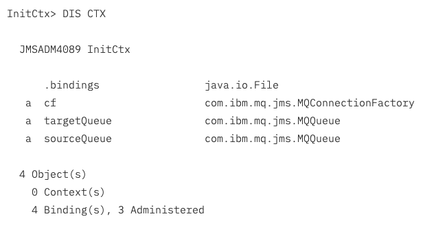

Using MQ JMS in a CICS OSGi JVM server
=======================================

Author: Matt Leming

At IBM InterConnect we recently announced support for using IBM MQ
classes for JMS (MQ JMS for the rest of this article) inside a CICS OSGi
JVM server (CICS). The aim of this article is to describe this support,
and walk through writing and deploying a simple MQ JMS application for
deployment in a CICS JVM server

## 1. What is the current support for interacting with IBM MQ in CICS using Java?

Currently if you want to interact with an IBM MQ (MQ) queue manager
using Java in CICS then you have to use the IBM MQ classes for Java (MQ
Java). These classes provide a MQI-like interface to the queue manager.
MQI stands for Message Queueing Interface, and is the standard way of
interacting with MQ using languages such as COBOL or C. If you already
have experience of the MQI then using MQ Java might be appropriate than
MQ JMS.

For further details on configuring MQ Java classes in CICS refer to the
article [Configuring the MQ Java
classes](https://developer.ibm.com/cics/2014/04/30/using-the-ibm-mq-classes-for-java-with-a-cics-jvm-server/)


## 2. Why might you want to use MQ JMS instead of MQ Java?

MQ JMS is an implementation of the JMS (Java Message Service)
interfaces, and as such conforms to the JMS specification. Applications
that use JMS are not tied to any specific messaging provider. For
example it should be possible to take an application that has been
written to interact via JMS with the messaging provider that comes with
WebSphere Application Server (WAS) and convert it to using MQ JMS,
without changing any of the application logic.

Additionally the JMS interfaces are simpler, and more commonly used than
MQ Java (as they are a standard)  so they are much easier to pick up and
learn.


## 3. What do you need to do to enable MQ JMS in CICS?


MQ JMS is supported when using CICS TS V5.2 with MQ V7.1 or MQ V8 z/OS
queue managers. The table below describes the specific APAR numbers required.

 
  |**Product**    | **APARs** |
  |---------------|-----------|
  |CICS TS V5.2   |PI32151    |
  |IBM MQ for z/OS |PI28482 queue manager changes **and** PI33038: the cumulative maintenance fixpack 8.0.0.2 for the JMS feature of IBM MQ for z/OS version 8.0.0. Or a later fixpack level. |
  |WebSphere MQ for z/OS 7.1|PI29770 **or** the cumulative maintenance fixpack for the JMS feature of WebSphere MQ for z/OS version 7.1.0 with a fixpack level of 7.1.0.7 or later. No APAR number for the fix pack is available at the time of writing.|


## 4. Differences in JMS levels

The version of JMS interfaces changed between MQ V7.1 and MQ V8. MQ V7.1
provides support for JMS 1.1. MQ V8 provides support for the latest
version of JMS, JMS 2. The JMS 2 interfaces are backwards compatible
with earlier versions of JMS and provide a number of improvements, the
most notable of which is a simpler API. Details on the differences
between the versions are described on the following two pages in the IBM
KnowledgeCenter:

-   [http://www.ibm.com/support/knowledgecenter/SSFKSJ_8.0.0/com.ibm.mq.dev.doc/q031960\_.htm](http://www.ibm.com/support/knowledgecenter/SSFKSJ_8.0.0/com.ibm.mq.dev.doc/q031960_.htm)
-   [http://www.ibm.com/support/knowledgecenter/SSFKSJ_8.0.0/com.ibm.mq.dev.doc/q119110\_.htm](http://www.ibm.com/support/knowledgecenter/SSFKSJ_8.0.0/com.ibm.mq.dev.doc/q119110_.htm)

 

## 5. How does MQ JMS in CICS work?

MQ JMS builds on the native support for MQ in CICS, which means that all
calls to the queue manager go through the CICS-WebSphere MQ adapter. MQ
JMS uses some calls which weren't previously supported by the
CICS-WebSphere MQ adapter which is why there is a need to apply the CICS
APAR mentioned in the table above.

The JMS interfaces were designed to run in a wide variety of
environments, from stand alone JVMs to Java Enterprise Edition (JEE)
runtimes such as WAS. As a result of this the JMS interfaces provide
functionality that isn't appropriate in all environments, including
CICS. The MQ JMS classes treat CICS as a JEE compliant application
server which always has a Java Transaction API (JTA) transaction in
progress. So any restrictions described in the JMS specification that
apply to the JEE web or Enterprise JavaBean (EJB) containers with a JTA
transaction in progress also apply to CICS.

A full list of restrictions are described in the [IBM MQ
KnowledgeCentre](http://www-01.ibm.com/support/knowledgecenter/SSFKSJ_8.0.0/com.ibm.mq.dev.doc/q121780_.htm).
The most important of these are as follows.

 

### 5.1. Units of work

All messages will be sent to, or received from, MQ under the currently
active CICS unit of work (UOW), unless the Session or JMSContext that
they were created with was itself created using the
Session.AUTO_ACKNOWLEDGE or JMSContext.AUTO_ACKNOWLEDGE flag.

For example, the code shown in listing 1 creates and sends a message to
MQ using the JMS 2 interfaces under the current CICS UOW because the
JMSContext.AUTO_ACKNOWLEDGE flag wasn't specified on the second line.

 

#### Listing 1: Using the current CICS UOW, example 1
```
ConnectionFactory cf = new MQConnectionFactory();             
JMSContext ctx = cf.createContext();
JMSProducer prod = ctx.createProducer();
prod.send(queue, ctx.createTextMessage("Hello World!"));
 ```
 

The code shown in listing 2 has the same effect. In this case, the flag is ignored as it isn't JMSContext.AUTO_ACKNOWLEDGE.

 

#### Listing 2: Using the current CICS UOW, example 2

```
ConnectionFactory cf = new MQConnectionFactory();
JMSContext ctx = cf.createContext(JMSContext.*DUPS_OK_ACKNOWLEDGE*);
JMSProducer prod = ctx.createProducer();
prod.send(queue, ctx.createTextMessage("Hello World!"));
```
 

Explicitly committing, or rolling back, the sending of this message can
be done using the commit() or rollback() methods on an instance of the
`com.ibm.cics.server.Task` class. For example, the code in listing 3 sends
a message to MQ and commits it.

 

#### Listing 3: Committing the send of a message

```
ConnectionFactory cf = new MQConnectionFactory();
JMSContext ctx = cf.createContext();
JMSProducer prod = ctx.createProducer();
prod.send(queue, ctx.createTextMessage("Hello World!"));
Task.getTask().commit();
```                                                                     


The only way of sending and receiving messages outside of the CICS UOW
with the JMSContext interface is shown in listing 4 below. There are
several different possibilities if using the JMS 2 variant of the
Session interface.

 

#### Listing 4: Not using the CICS UOW with a JMSContext

```
ConnectionFactory cf = new MQConnectionFactory();             
JMSContext ctx = cf.createContext(JMSContext.*AUTO_ACKNOWLEDGE*);
JMSProducer prod = ctx.createProducer();
prod.send(queue, ctx.createTextMessage("Hello World!"));

```

It is worth pointing out that receiving persistent messages will always
be done under the CICS UOW even if the AUTO_ACKNOWLEDGE flag is
specified. Receiving of non-persistent messages will be done under the
CICS UOW regardless of the AUTO_ACKNOWLEDGE flag only if the connection
factory has been configured to use syncpoint all gets as shown in
listing 5.

 

#### Listing 5: Specifying sync point all gets on an MQ connection factory

```
MQConnectionFactory cf = new MQConnectionFactory();
cf.setSyncpointAllGets(true);
```

### 5.2. No support for listeners

JMS provides support for a number of different listener interfaces such
as javax.jms.MessageListener, javax.jms.ExceptionListener and, if using
JMS 2, the javax.jms.CompletionListener. All of these interfaces result
in MQ JMS using multiple threads which is not supported in a CICS
environment. This same restriction also applies to JEE environments such
as WAS.

Attempting to register one of these listeners will result in either a
JMSException or a JMSRuntimeException, with a suitable message,
depending on whether the JMS 1 or JMS 2 interfaces are used.

 

### 5.3. User id and password are not supported

The JMS interfaces allow a user id and password to be specified when
connecting for authentication and authorization purposes. These can be
provided in several ways, for example the code shown in listing 6.

 

#### Listing 6: Creating a connection using a user id and password

```
ConnectionFactory cf = new MQConnectionFactory();
Connection con = cf.createConnection("userID", "password");
```


However, because MQ JMS builds on the native support for MQ in CICS, it
makes use of the existing security support which is described
[here](http://www.ibm.com/support/knowledgecenter/SSFKSJ_8.0.0/com.ibm.mq.sec.doc/q012170_.htm).
As a result of this any attempt to create either a connection or JMS
context object while specifying a user id or password will result in
either a JMSException or JMSRuntimeException depending on whether the
JMS 1 or JMS 2 interfaces are used.

 

## 6. Is there anything else you should be aware of?

Here are some other things that it is useful to be aware of.

 

### 6.1. An MQCONN definition is required

As MQ JMS builds on the native support for MQ in CICS an MQCONN resource
must be defined. The name of the queue manager, or queue sharing group,
to which MQ JMS will connect is taken from this MQCONN definition.
Attempting to programmatically specify a queue manager, or queue sharing
group, name as shown below in listing 7 will have no effect.

 

#### Listing 7: Specifying a queue manager name

```
MQConnectionFactory cf = new MQConnectionFactory();
cf.setQueueManager(\"MQ21\"); //Ignored.
JMSContext ctx = cf.createContext();

```

 
### 6.2. Bindings mode connections only
Only bindings mode connections to a local queue manager are supported.
An attempt to create a client mode connection to either a z/OS or
distributed queue manager will result in an exception being thrown that
contains the following message: "JMSFMQ0005: The use of a client
connection is not supported within the current environment".

This is exactly the same behaviour that would occur when using MQ JMS in
a stand alone batch environment on z/OS. The only time client mode MQ
JMS connections are supported on z/OS is when running in a WAS
environment.

 
### 6.3. The API exit will be driven
All calls made to the queue manager using MQ JMS will result in the
CICS-WebSphere MQ API exit program (CSQCAPX) being called, if it is
enabled.

 

### 6.4. CICS Liberty JVM server support }

Support for using JMS with MQ inside a CICS Liberty JVM server is now
provided in CICS TS V5.3 and V5.4 and is covered in this article
[Developing an MQ JMS application for CICS
Liberty](https://developer.ibm.com/cics/2017/07/28/developing-jms-application-cics-liberty/)

 

### 6.5. Don't reuse JMS resources

Any applications that make use of MQ JMS in CICS should make sure that
all JMS resources are recreated from an MQConnectionFactory each time
the application is run. I.e. application code should not store instances
of sessions, message consumers, or any other MQ JMS objects in static variables so that they can be shared between runs of the application.

This restriction exists because the CICS-WebSphere MQ adapter will tidy
up any resources such as queue input handles after the transaction that
created them completes. If you then try and use one of these resources
in a different run of the same, or any other, transaction you will end
up with JMS exceptions being thrown containing messages such as the
following:

```
JMSCS0006: An internal problem occurred. Diagnostic information for service was written to '/u/mleming/JVMProfilesLib/FFDC/JMSCC1155.FDC'. Please terminate the application as the product is in an inconsistent internal state.
```

Other error messages are also possible  depending on exactly which JMS
object has been reused.

 

## 7. Developing a simple JMS application 

The remainder of this article describes creating and deploying a simple
Java application (QAdd). QAdd will use JMS to connect to a queue
manager, receive up to 50 messages containing numbers from a source
queue, add the values together, and then send another message containing
the result of the addition to a target queue. This application has been
written to use the JMS 1.1 interfaces as it can then be used with either
MQ 7.1 or MQ 8.0.

The rest of this article makes several mentions of JNDI, and using the
file system JNDI repository (FS JNDI).  

### 7.1. OSGi bundles
QAdd was developed against MQ V8. The main differences between the two
versions of MQ in this case are the sets of MQ OSGi bundles that are
needed.

The MQ OSGi bundles are stored on the zFS under *JAVA_DIR*/lib/OSGi.
Where *JAVA_DIR* is the path of the Java part of the IBM MQ for z/OS
UNIX System Services Component, for example: /mqm/V8R0M0/java.

For MQ V8 you need to use the `com.ibm.mq.osgi.allclient_8.0.0.2.jar` and
`com.ibm.mq.osgi.allclientprereqs_8.0.0.2.jar` bundles. Note that the
number at the end of the jars, i.e. the 2, will vary depending on
exactly what version of MQ JMS code you are using. In this example the
versions provided in APAR PI33038 are used.

MQ V7.1 packages its OSGi bundles differently. In this case you need the
following bundles, again the numbers at the end will vary.

- com.ibm.msg.client.osgi.jms.prereq_7.1.0.7.jar
- com.ibm.msg.client.osgi.jms_7.1.0.7.jar
- com.ibm.msg.client.osgi.commonservices.j2se_7.1.0.7.jar
- com.ibm.msg.client.osgi.nls_7.1.0.7.jar
- com.ibm.msg.client.osgi.wmq_7.1.0.7.jar
- com.ibm.msg.client.osgi.wmq.prereq_7.1.0.7.jar
- com.ibm.msg.client.osgi.wmq.nls_7.1.0.7.jar

 

### 7.2. Configuring CICS

In order to use MQ JMS in CICS you need to first configure the
CICS-WebSphere MQ adapter. This is described in
the[ CICS TS knowledge center](http://www.ibm.com/support/knowledgecenter/SSGMCP_5.2.0/com.ibm.cics.ts.wmq.adapter.doc/topics/zs11290_.html).

Once that is complete you need to add the following lines to the JVM
profile for the OSGi JVM server that will be running the MQ JMS code.
Note that you might be using a different value of JAVA_DIR from
/mqm/V8R0M0/java.

```
LIBPATH_SUFFIX=/mqm/V8R0M0/java/lib
OSGI_BUNDLES=/mqm/V8R0M0/java/lib/OSGi/com.ibm.mq.osgi.allclientprereqs_8.0.0.2.jar,
             /mqm/V8R0M0/java/lib/OSGi/com.ibm.mq.osgi.allclient_8.0.0.2.jar
```

The LIBPATH_SUFFIX is used by the JVM, and MQ JMS, to search for native
dynamic link libraries, and is the same regardless of the version of MQ
that you are using. The first native library that MQ JMS loads up is
called libmqjbnd64.so. This is used to detect the current runtime
environment. As the environment is CICS, the next library that gets
loaded is libmqjcics64.so. This library routes calls from MQ JMS through
the CICS-WebSphere MQ adapter to the queue manager.

The OSGI_BUNDLES property is used to define the set of middleware OSGi
bundles that get enabled when the OSGi framework starts up. For MQ JMS
you need to add the appropriate set of bundles described in the 'OSGi
bundles' section to any bundles that you might already be using.

 

### 7.3. Configuring MQ
No special configuration is required to enable an MQ queue manager to
receive connections from an MQ JMS application running in CICS. However,
if you have MQ security enabled you may need to adjust your security
settings to enable CICS to connect to your queue manager. You might also
need to allow CICS to access the the two queues used by QAdd. Talking of
which, these two queues need defining using the following two MQSC
commands:

 

```
DEF QL('QADDSource')
DEF QL('QADDTarget')
```

 

 

### 7.4. Creating JNDI resources {#creating-jndi-resources dir="ltr"}

This section describes how to configure the JNDI repository used by
QAdd. MQ supports two ways of creating MQ JMS resources in a JNDI
repository: MQ Explorer, and the MQ JMS administration  tool (JMS
admin). Both of which are described
[here](http://www.ibm.com/support/knowledgecenter/SSFKSJ_8.0.0/com.ibm.mq.con.doc/q123350_.htm).

To use JMS admin a configuration file is needed. The one used in this
example was called JMSAdminCICSDev.config, and is shown in listing 8.
The first line is the class that is used to connect to the JNDI
repository. In this case the FS JNDI repository is to be used. The
second line is a URL specifying the zFS directory that the repository
will be contained in. The last line indicates that security is not
required.

 

#### Listing 8: Contents of JMSAdminCICSDev.config

```
INITIAL_CONTEXT_FACTORY=com.sun.jndi.fscontext.RefFSContextFactory    
PROVIDER_URL=file:///u/mleming/jndi/                                  
SECURITY_AUTHENTICATION=none                                           
```                                                                   


JMS admin was then ran, specifying the customized configuration file, as follows:

```
JAVA_DIR/bin/JMSAdmin -cfg ~/JMSAdminCICSDev.config
```

The output of starting JMS admin is showed in figure 1 below.

 

#### Figure 1: Output from starting JMS admin

```
Licensed Materials -- Property of IBM                               
5724-H72, 5655-R36, 5724-L26, 5655-L82
(c) Copyright IBM Corp. 2008, 2011 All Rights Reserved.
US Government Users Restricted Rights -- Use, duplication or
disclosure restricted by GSA ADP Schedule Contract with
IBM Corp.
Starting WebSphere MQ classes for Java(tm) Message Service           
Administration    

InitCtx\>                                                       
```
 

A simple connection factory definition was then created with a key
called cf. A queue manager name wasn't provided as there is no need to
do this in CICS as mentioned earlier. This was done using the following
JMS admin command:

```
DEF CF(cf)
```

Two queues were then defined. The first queue was called QADDSource and
had a key of sourceQueue. The second was QADDTarget with a key of
targetQueue. Note that the queue names need to match those created above
in the \'Configuring MQ\' section. The JMS admin commands for this are
as follows:

```
DEF Q(sourceQueue) QU(QADDSource)
DEF Q(targetQueue) QU(QADDTarget)
```

To validate that the JNDI resources had been created correctly the DIS
CTX command was
issued. This gave the output shown in figure 2. The \'a\' before the
three objects that were just created indicates that they are
administered.

 

#### Figure 2: Output from DIS CTX command



`END` was then entered to exit the tool.

The contents of the FS JNDI repository are stored in a file called
.bindings in the directory specified by the PROVIDER_URL value shown in
listing 8 above. The .bindings file will be created in ASCII, but there
is no need to convert it to the code page used by your JVM server as the
FS JNDI repository implementation will deal with that.
 

### 7.5. Setting up a development environment
Several OSGi bundles need to added to your Eclipse environment in order
to write an application that uses MQ JMS. These bundles include the JMS
interfaces, the MQ JMS implementation itself, and any other prerequisite
jars that it requires. The list of  bundles is described above in the
\'OSGi bundles\' section.

Follow the steps described
[here](http://www.ibm.com/support/knowledgecenter/SSGMCP_5.2.0/com.ibm.cics.ts.java.doc/topics/update_target.html)
to add the set of bundles for the version of MQ that you will be using
to the CICS® TS V5.2 target platform.

 

### 7.6. Developing the code

Writing the code for QAdd is relatively simple using Eclipse and the
CICS Explorer SDK. As it is assumed that you already have experience
with Eclipse the steps below are described only briefly. For further
details refer to the IBM Redbook
[CICS and the JVM server: Developing and Deploying Java Applications ](http://www.redbooks.ibm.com/abstracts/sg248038.html?Open)

First you need to create a plug-in project called CICSDevCode, using the
JavaSE-1.7 JRE, and adding the standard OSGi framework. Don\'t select
the option to generate a bundle activator, we will do that manually
later on.

Next update the generated MANIFEST.MF in the CICSDevCode project so that
it looks like listing 9 below. You will get a warning that the class
specified by the Bundle-Activator stanza doesn't exist. We will fix
that in a minute.

 

#### Listing 9: Contents of MANIFEST.MF

```
package sample.jms;

import javax.naming.spi.InitialContextFactory;
import javax.naming.spi.ObjectFactory;
import org.osgi.framework.BundleActivator;
import org.osgi.framework.BundleContext;
import com.ibm.mq.jms.MQConnectionFactoryFactory;
import com.ibm.mq.jms.MQQueueFactory;
import com.sun.jndi.fscontext.RefFSContextFactory;

/**
 * Bundle activator that registers the MQ object factories and the
 * initial context factory for the FS JNDI provider.
 */
public class QAddBundleActivator implements BundleActivator
{

  @Override
  public void start(BundleContext ctx) throws Exception
  {
    //Register the initial context factory implementation.
    ctx.registerService(new String[]{InitialContextFactory.class.getName(),            
                                     RefFSContextFactory.class.getName()},
                        new RefFSContextFactory(),
                        null);

    //Register the MQ object factories that we are using.
    //If you were using other MQ JMS objects, such as MQTopic, you would
    //register the relevant object factory here too.
    String ofClassName = ObjectFactory.class.getName();

    ctx.registerService(new String[]{ofClassName,
                                     MQConnectionFactoryFactory.class.getName()},
                        new MQConnectionFactoryFactory(),
                        null);

    ctx.registerService(new String[]{ofClassName,
                                     MQQueueFactory.class.getName()},
                        new MQQueueFactory(),
                        null);
  }

  @Override
  public void stop(BundleContext ctx) throws Exception
  {
  }
}

```


The QAdd application consists of two Java classes: QAddBundleActivator,
and QAdd. Both of these classes need to be created in the CICSDevCode
project in a package called `sample.jms`.

QAddBundleActivator is an OSGi bundle activator, as the name suggests.
This is used to set up the JNDI environment which will be used by the
QAdd class. In order to use JNDI in any OSGi environment there are two
steps that need to be performed. Firstly an instance of the initial
context factory class for your JNDI repository needs to be registered as
an OSGi service. Secondly instances of the object factory classes for
the resources that will be looked up from JNDI also need adding as OSGi
services. QAddBundleActivator performs both these tasks and is shown in
the listing 10 below.

Use CICS Explorer to create a new class called QAddBundleActivator with
a package name of sample.jms in the CICSDevCode project. Then copy the
contents of listing 10 to it. Save your changes.

 

#### Listing 10: Contents of QAddBundleActivator.java

```
package sample.jms;

import javax.naming.spi.InitialContextFactory;
import javax.naming.spi.ObjectFactory;
import org.osgi.framework.BundleActivator;
import org.osgi.framework.BundleContext;
import com.ibm.mq.jms.MQConnectionFactoryFactory;
import com.ibm.mq.jms.MQQueueFactory;
import com.sun.jndi.fscontext.RefFSContextFactory;

/**
 * Bundle activator that registers the MQ object factories and the
 * initial context factory for the FS JNDI provider.
 */
public class QAddBundleActivator implements BundleActivator
{

  @Override
  public void start(BundleContext ctx) throws Exception
  {
    //Register the initial context factory implementation.
    ctx.registerService(new String[]{InitialContextFactory.class.getName(),            
                                     RefFSContextFactory.class.getName()},
                        new RefFSContextFactory(),
                        null);

    //Register the MQ object factories that we are using.
    //If you were using other MQ JMS objects, such as MQTopic, you would
    //register the relevant object factory here too.
    String ofClassName = ObjectFactory.class.getName();

    ctx.registerService(new String[]{ofClassName,
                                     MQConnectionFactoryFactory.class.getName()},
                        new MQConnectionFactoryFactory(),
                        null);

    ctx.registerService(new String[]{ofClassName,
                                     MQQueueFactory.class.getName()},
                        new MQQueueFactory(),
                        null);
  }

  @Override
  public void stop(BundleContext ctx) throws Exception
  {
  }
}

```

The QAdd class contains the application logic and is commented
throughout. QAdd is shown in listing 11. Use CICS Explorer to create a
new class called QAdd with a package name of sample.jms in the
CICSDevCode project. Then copy the contents of listing 11 to it. Save
your changes.

 

#### Listing 11: Contents of QAdd.java

```
package sample.jms;

import java.util.Hashtable;
import javax.jms.Connection;
import javax.jms.ConnectionFactory;
import javax.jms.Message;
import javax.jms.MessageConsumer;
import javax.jms.MessageProducer;
import javax.jms.Queue;
import javax.jms.Session;
import javax.jms.TextMessage;
import javax.naming.Context;
import javax.naming.InitialContext;
import com.ibm.cics.server.InvalidRequestException;
import com.ibm.cics.server.Task;

/**
 * Receives up to 50 messages containing numbers from one queue, adds them together
 * and sends them to another queue.
 */

public class QAdd
{
  //Maximum number of messages to receive.
  private static final int MAX_MESSAGES = 50;

  public static void main(String args[])
  {
    Task task = Task.getTask();

    try
    {
      //The value we are going to put in a message on the targetQueue.
      int sum = 0;

      //Create the JNDI initial context.
      Hashtable<String, String> environment = new Hashtable<>();
      environment.put(Context.PROVIDER_URL, "file:///u/mleming/jndi/");
      environment.put(Context.INITIAL_CONTEXT_FACTORY,
                      "com.sun.jndi.fscontext.RefFSContextFactory");
      Context ctx = new InitialContext(environment);

      //Locate the connection factory and the two queues.
      Queue sourceQueue = (Queue)ctx.lookup("sourceQueue");
      Queue targetQueue = (Queue)ctx.lookup("targetQueue");
      ConnectionFactory cf = (ConnectionFactory)ctx.lookup("cf");

      //Connect to MQ and create a session that will allow messages to be processed
      //under the CICS UOW.
      Connection connection = cf.createConnection();

      //NB: if using JMS 2 you would probably code the following here as it is
      //more concise.
      //Session session = connection.createSession();
      //Or you could use a JMSContext instead.
      Session session = connection.createSession(true, Session.SESSION_TRANSACTED);

      //Remember to start the connection, otherwise we won't be able to
      //receive messages.
      connection.start();

      //Create the message consumer.
      MessageConsumer consumer = session.createConsumer(sourceQueue);

      //Receive up to 50 messages from the queue. Don't wait for messages to arrive.
      int i = 0;

      for(; i < MAX_MESSAGES; i++)
      {
        Message message = consumer.receiveNoWait();

        //Break out of loop if we get a null message as this means that the
        //queue is empty.
        if(message == null)
        {
          task.out.println("No message received, leaving loop.");
          break;
        }

        //Only process text messages.
        if(message instanceof TextMessage)
        {
          //Get the text and convert to an int.
          TextMessage textMessage = (TextMessage)message;
          String text = textMessage.getText();
          int nextInt;

          try
          {
            nextInt = Integer.parseInt(text);
          }
          catch(NumberFormatException nfe)
          {
            task.out.println("Message didn't contain an int, ignoring.");
            continue;
          }

          task.out.println("Message received, integer value = " + nextInt + ".");

           //Add to the running total.
           sum += nextInt;
         }
         else
         {
           task.out.println("Unexpected message received, ignoring.");
         }
       }

       //Create a message producer.
       MessageProducer producer = session.createProducer(targetQueue);

       //Create a text message containing sum.
       TextMessage sumMessage = session.createTextMessage("" + sum);

       //Send the message.
       producer.send(sumMessage);

       task.out.println("Sum of " + i + " messages is " + sum + ".");

       //Close all the JMS resources by closing the connection.
       connection.close();

       //Use implicit synch point to commit the messages.
     }
     catch(Exception e)
     {
       //Output debug information and rollback messages.
       task.out.println("Exception caught: " + e.getMessage());
       e.printStackTrace();

       try     
       {
         task.rollback();
       }
       catch (InvalidRequestException e1)
       {
         task.out.println("Exception caught from rollback: " + e1.getMessage());
         e1.printStackTrace();
       }
     }
  }
}
```

Lastly create a CICS bundle project with a name of CICSDevBundle. Then
use the CICS bundle manifest editor to create a new OSGi bundle project
reference which refers to the CICSDevCode project. Specify the name of a
JVM server which uses the JVM profile that was updated in section
\'Configuring CICS\'.

 

### 7.7. Deploying the code

Again, nothing special is required to deploy an MQ JMS application to
CICS. You use CICS Explorer to deploy the CICSDevBundle project to the
zFS that is used by the JVM server which references the JVM profile that
was modified in the \'Configuring CICS\' section.

You then use CEDA, or CICS Explorer, to define and install the
following:

-   A bundle definition with its BUNDLEDIR attribute pointing to the
    exported CICSDevBundle project on your zFS.
-   A PROGRAM definition which has a JVMCLASS value of sample.jms.QAdd.
-   And lastly a TRANSACTION definition with a name of QADD that has a
    PROGRAM value referencing the program definition created previously.

Once all these are installed and enabled you are ready to go.

 

### 7.8. Running the code

In order to get any meaningful output from the QADD transaction you will
need to pre-load the QADDTarget queue with messages. There are many
different ways to do this, but the simplest would be to choose one of
the following three approaches:

1.  Use MQ Explorer.
2.  Use the MQ supplied batch samples. For example the CSQ4BCJR JCL can
    be copied and edited to put single digit messages using the CSQ4BCK1
    executable.
3.  Use the MQ supplied CICS sample, CSQ4CCK1.

Information on using the MQ samples can be found in
the [MQ documentation](http://www.ibm.com/support/knowledgecenter/SSFKSJ_8.0.0/com.ibm.mq.dev.doc/q025040_.htm).

All three of these approaches send MQ messages with a format of MQSTR.
These are automatically converted by MQ JMS to JMS TextMessage objects.
If you send messages to the queue in a format that MQ JMS can\'t convert
into a JMS TextMessage object then you will get a JMSException.

MQ Explorer was then used to put the values 10, 20, 30, ..., 100 on
QADDSource and then ran the QADD transaction.  

If you get any errors when running the QADD transaction have a look at
the next section which shows some common errors and how to resolve them.

MQ Explorer was then used to browse the QADDTarget queue to check that
the results of the QADD transaction had been sent successfully.
 

## 8. Errors from QADD and how to resolve them

Here are some of the possible errors you may see when using the QADD
sample.

**Terminal message:** Exception caught: JMSWMQ2008: Failed to open MQ
queue \'QADDSource\'
**Problem:** The QADDSource queue hasn\'t been created.
**Solution:** Use the instructions in the \'Configuring MQ\' section to
create it.

**Terminal message:** Exception caught: JMSWMQ0018: Failed to connect
to queue manager \'\' with connection mode \'Bindings\' and host name
\'localhost(1414)\'
**Problem:** The MQCONN definition hasn't been defined or isn't
connected.
**Solution:** Follow the instructions in the \'Configuring CICS\'
section to ensure you have set up the CICS-WebSphere MQ adapter
correctly. Ignore the fact the the message includes host name and port
information, those are just the defaults. Likewise the empty single
quotes are because the queue manager name hasn't been specified.

**Terminal message:** Exception caught:
sourceQueue], or
Exception caught:
null
**Problem:** These unhelpful messages come from the FS JNDI provider.
More information will be provided in system error log for the JVM
server, for example:

 

```
        javax.naming.NameNotFoundException: sourceQueue
        at com.sun.jndi.fscontext.RefFSContext.getObjectFromBindings(RefFSContext.java:400)
        at com.sun.jndi.fscontext.RefFSContext.lookupObject(RefFSContext.java:327)
        at com.sun.jndi.fscontext.RefFSContext.lookup(RefFSContext.java:146)
        at com.sun.jndi.fscontext.FSContext.lookup(FSContext.java:127)
        at org.apache.aries.jndi.DelegateContext.lookup(DelegateContext.java:161)
        at javax.naming.InitialContext.lookup(InitialContext.java:422)
        at sample.jms.QAdd.main(QAdd.java:43)
    <ETC>
```

 

This stack trace means that either the FS JNDI repository that you are
using doesn't exist in the specified directory, but the directory does
exist; or that the queue with key \'sourceQueue\' hasn't been added to
the repository.

**Solution:** Make sure that you have followed the instructions in the
\'Creating JNDI resources\' section, and that the line of QAdd code
shown in listing 12 points to the directory that you are using.

 

#### Listing 12: Specifying the provider URL

 ```                      |
environment.put(Context.PROVIDER_URL, "file:///u/mleming/jndi/");   
```

 

## 9. Summary

This article describes the recently added support for using MQ JMS
inside CICS OSGi JVM servers. A walk through of creating, deploying and
running an MQ JMS application inside CICS is provided.

 

### 10. About the author

Matt Leming has worked at the IBM Hursley laboratory for 12 years,
either in the WebSphere Application Server or IBM MQ development teams.
Currently he works in MQ for z/OS development. He holds an MSc in
software engineering from Oxford University and a BSc in mathematics
from Loughborough University. He has published several IBM
developerWorks articles and recently was an author on the IBM MQ V8
Features and Enhancements Redbook. He has just finished adding support
for MQ JMS in CICS OSGi JVM servers.

 

### 11. References

-   [MQ JMS in CICS content in MQ 8 KnowledgeCenter](http://www.ibm.com/support/knowledgecenter/SSFKSJ_8.0.0/com.ibm.mq.dev.doc/q121740_.htm)
-   [MQ JMS in CICS content in MQ 7.1 KnowledgeCenter](http://www.ibm.com/support/knowledgecenter/SSFKSJ_7.1.0/com.ibm.mq.doc/q121740_.htm)
-   [MQ JMS in CICS content in CICS 5.2 KnowledgeCenter](http://www-01.ibm.com/support/knowledgecenter/SSGMCP_5.2.0/com.ibm.cics.ts.java.doc/topics/dfhpj_webspheremq_jmsosgi.html)
-   [The JMS 2.0 specification](https://java.net/projects/jms-spec/pages/JMS20FinalRelease)
-   [MQ V8 Features and Enhancements](http://www.redbooks.ibm.com/abstracts/sg248218.html?Open) IBM
    Redbook
